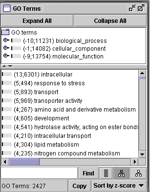

# Table of Contents

### How to Use

1. [Interacting with Sungear](#interacting-with-sungear)
2. [Control Dialog](#control-dialog)
3. [Genes Dialog](#genes-dialog)
4. [GO Terms Dialog](#go-terms-dialog)
5. [Sungear Dialog](#sungear-dialog)
6. [(optional) GeneLights Dialog](#genelights-dialog)

### Definitions

1. [Anchors](#anchors)
2. [Vessels](#vessles)
3. [GO Terms](#go-terms)

### Troubleshooting

### Data Files

1. [Sungear data file Documentation]
2. [Adding new data (experiments, species, hierarchies) to Sungear]

### Interfacing with Sungear from third-party applications

1. [Data exchange using a web application]

## 

## Interacting with Sungear

__Selecting__

Almost all dialogs in Sungear allow the selection of elements or groups of elements. Selected elements will often highlight or affect values seen across all the dialogs.

For Mac users:
* `alt` = options/alt key
* `ctrl` = apple key

__Basic__
* `left click`: select an item in a list, or a vessel or anchor inside the sungear dialog.
* `shift left click`: select a range of items in a list. Left Click the first item of the range then Shift Left Click on the final item to select the range.

__Advanced__
Once the basics of selecting have been mastered there are two additional types of selection in Sungear that allow more control over the data.
* `ctrl left click`: Unions an anchor/vessel/term with a previous selection. From then on, toggles between selecting all or none of the genes in the anchor/vessel/term.
* `ctrl alt left click`: Starts a multiple select for union and intersection. Performing this action will highlight the union and the Intersection buttons in the control dialog. Once elements have been selected pressing the Union or Intersection button finishes the command.

## Control dialog

__What you are seeing__

The general management tool for sungear data.
* Restart: reloads data set
* All: select all groupings
* None: select no groupings
* << : Go backward to a previous selection
* >> : Go forward to a selection
* Narrow: Create a new group based on selected elements and clears selection history.
* Union  : Union two or more selected elements. Select multiple elements using `ctrl-alt left-click`, then click _Union_.
* Intersect  : Intersect two or more selected elements. Select multiple elements using `ctrl-alt left-click`, then click _Intersect_.
* Find Cool: Find the vessel consisting of the most overrepresented set. The results are saved after the first click. If saved results are available, the button will read "Show Cool".
* Export: Export data set
* View Group  : View this group

## Genes Dialog

__What you are seeing__

The main part of the genes dialog is the table that contains ID and Description. This gives you the gene ID and the description. Selecting a gene from this list will highlight associated vessels in the Visualizations dialog. Also selections made from the Visualizations dialog will highlight the corresponding genes in the genes dialog.

The numbers in the lower left corner represent the number of genes selected and the total number of genes in the current group, chosen by a narrow or a view group operation, just like at the lower right of the sungear dialog.

## GO Terms Dialog

The upper window shows the GO Terms, in hierarchal fashion, that can be selected.

The bottom window shows the GO Terms in list fashion sorted by z-score.

 The bar to the left is a visual representation of the number of selected genes for that term, relative to the total number of genes for that term in the current group. The number on the left is the z-score. The number on the right is the total number of genes for that term.

## Sungear Dialog

__What you are seeing.__

Anchors are names you see circling the display. Vessels are in the center. The number in the upper right hand corner is the number of selected genes in the current highlighted vessels/anchors. The numbers in the lower right hand corner are the number of genes selected and the total number of genes respectively. In the lower left hand corner are arrows that allow you to move backwards and forwards through anchors.

## GeneLights Dialog

__What you are seeing__

Some experiments provide extra data to enable the GeneLights window, which can be opened by navigating to View | GeneLights. Given a value for each gene and experiment, GeneLights displays the distribution values for each experiment as a histogram shown above. Typical biological values are gene expression, or a function thereof such as the (log) fold change in expression. When the user selects a set of genes in another window, GeneLights highlights that set in the histogram, leaving the full set genes visible in a shadow histogram (similar to how selection of some genes in a vessel is show in the Sungear window).

Clicking on a bar in a histogram in the GeneLights window selects the genes with that value. `ctrl-click` on additional bars in any histogram will select additional sets of genes. Clicking and dragging on a histogram will select genes in that range for that experiment, and clicking and draggin in the top area selects genes in that range across all experiments.

## Definitions

### Anchors

A list of genes corresponding to some outcome of an experiment (e.g. the induced genes). Anchor terms can be seen surrounding the visualization circle in the sungear dialog.

### Vessels

List of genes in the intersection of the anchors to which that vessel points and that are not in the intersection of any superset of those anchors. Selecting a vessel highlights the genes in the [Genes Dialog](#genes-dialog) as well as all anchors associated. Size depends on the ratio of genes found inside the vessel compared to the total number of genes in the last created group.

### GO Terms

Gene Ontology Terms, name for genes that participate in particular functions.

## Troubleshooting
